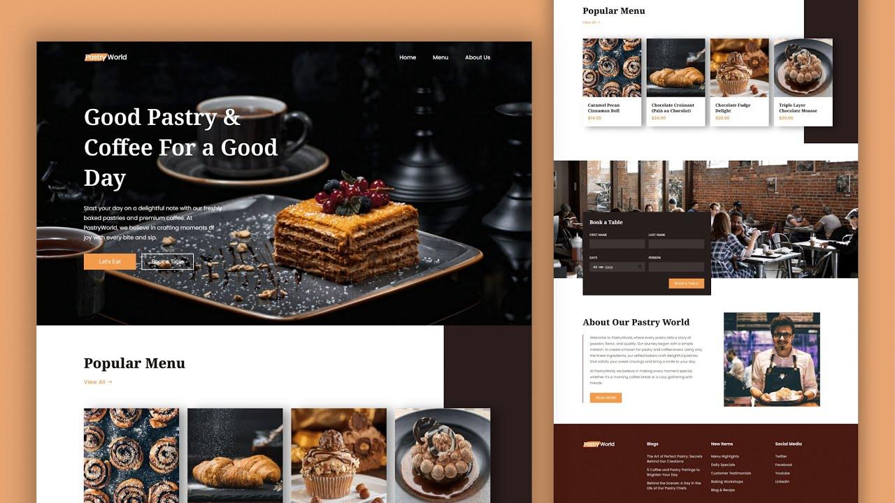

# 🍰 Pastry World - Bakery Website

Welcome to **Pastry World**, a beautifully designed bakery website featuring a modern and aesthetic UI for pastry lovers! This project is built using **HTML & CSS**, making it fully responsive and visually appealing.

## 🚀 Features
- ✅ **Elegant UI** - Aesthetic design with a delightful user experience.  
- ✅ **Smooth Navigation** - Easy-to-use menu for a seamless browsing experience.  
- ✅ **Book a Table Feature** - Reserve a table online with a simple form.  
- ✅ **Fully Responsive** - Looks great on all devices, from desktops to mobile phones.  
- ✅ **Interactive Buttons & Animations** - Enhances user engagement.  

## 📌 Technologies Used
- **HTML5** for structure 📜
- **CSS3** for styling 🎨
- **Remix Icons** for beautiful icons ✨
- **ScrollReveal.js** for animations 🎭

## 🖥️ Preview


## 📂 Installation & Usage
1. **Clone the repository:**  
   ```bash
   git clone https://github.com/Shivamgpt812/pastry-world.git
   ```
2. **Open `index.html` in your browser**  
3. Enjoy the delightful UI! 🎂

## 🎥 Demo
Check out the live demo here: [Live Preview](#)

## 🔗 Connect with Me
- 📌 **YouTube**: [ValiCodeLab](#https://www.youtube.com/@ValiCodeLab)
- 💼 **Portfolio**: [Shivam](#https://portfolio08shivam.netlify.app/)

🔔 **Don't forget to ⭐ the repo if you like it!** ⭐
